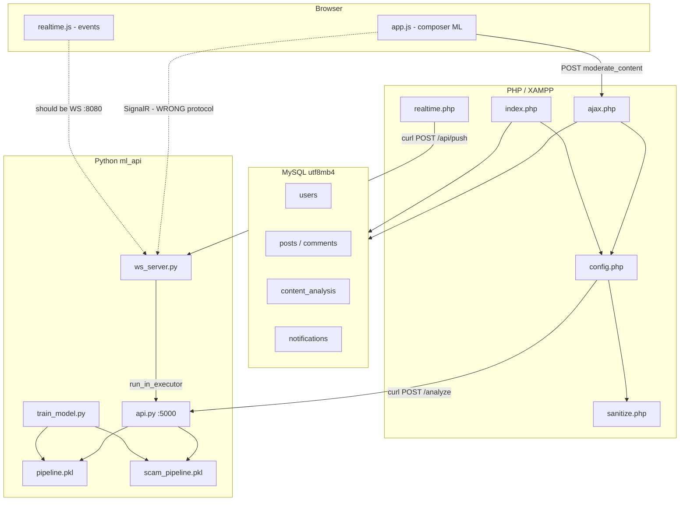

# ApexSocial — Full System & Technology Audit

**Project:** `c:\xampp\htdocs\apexsocial`  
**Audit date:** 2026-05-20  
**Version referenced:** ML API v6.1, Trainer v6.0  
**Scope:** Every technology layer + maximum detail on Machine Learning  

---

## Table of contents

1. [Executive summary](#1-executive-summary)
2. [Services & ports](#2-services--ports)
3. [Architecture diagram](#3-architecture-diagram)
4. [Technology inventory](#4-technology-inventory)
5. [PHP application layer](#5-php-application-layer)
6. [MySQL database layer](#6-mysql-database-layer)
7. [Python ML API (Flask)](#7-python-ml-api-flask)
8. [Machine Learning — complete pipeline](#8-machine-learning--complete-pipeline)
9. [Training system](#9-training-system)
10. [Online / incremental learning](#10-online--incremental-learning)
11. [Real-time system (WebSocket)](#11-real-time-system-websocket)
12. [Frontend JavaScript](#12-frontend-javascript)
13. [Legacy C# backend](#13-legacy-c-backend)
14. [Security audit](#14-security-audit)
15. [Data files & artifacts](#15-data-files--artifacts)
16. [End-to-end flows](#16-end-to-end-flows)
17. [Known bugs & inconsistencies](#17-known-bugs--inconsistencies)
18. [Operational checklist](#18-operational-checklist)
19. [Recommendations (prioritized)](#19-recommendations-prioritized)

---

## 1. Executive summary

ApexSocial is a **social network** built on **PHP + MySQL**, with **content moderation** delegated to a **Python microservice** using **scikit-learn**. A second Python process provides **WebSocket real-time** notifications and live ML preview. The system is **hybrid**: ML models, keyword lists, URL heuristics, Unicode integrity checks, optional transformer semantics, and linguistic context rules.

| What works today (authoritative) | What is broken or misaligned |
|--------------------------------|-----------------------------|
| PHP → `:5000/analyze` for all moderation | Browser still uses **SignalR** client; server speaks **native WebSocket** |
| Posts/comments stored with ML metadata | `api.py` calls undefined `_record_sample_and_maybe_retrain()` → can crash `/analyze` |
| Admin queue + pending/review flow | `BACKEND_URL` points to push port **8081**, but UI expects **WS :8080** |
| Offline training via `train_model.py` | C# `Backend/` still in repo but unused by PHP |

---

## 2. Services & ports

| Service | Technology | Bind address | Port | Start command |
|---------|------------|--------------|------|---------------|
| Web + PHP | Apache (XAMPP) | `HTTP_HOST` | 80 | XAMPP |
| Database | MySQL 8 | `127.0.0.1` | 3306 | XAMPP MySQL |
| **ML API** | Flask + Waitress | `0.0.0.0` | **5000** | `python api.py` |
| **WebSocket** | `websockets` + asyncio | `0.0.0.0` | **8080** | `python ws_server.py` |
| **HTTP Push** | `aiohttp` | `0.0.0.0` | **8081** | (same process as WS) |
| Legacy hub | C# SignalR (optional) | `0.0.0.0` | 8080 | `dotnet run` — **conflicts with WS** |

**Constants (PHP):**

| Constant | Value | Meaning |
|----------|-------|---------|
| `ML_API_URL` | `http://127.0.0.1:5000` | ML classification |
| `BACKEND_URL` | `http://{HTTP_HOST}:8081` | Push API only (via `realtime.php`) |
| `REALTIME_PUSH_KEY` | `apex-ws-key-2025` | Push authentication |

---

## 3. Architecture diagram



**Authoritative moderation path:**

```
User / PHP  →  HTTP POST 127.0.0.1:5000/analyze  →  JSON verdict
```

**Not used for moderation:**

```
PHP  →  C# :8080  →  ML   (legacy, exists in repo only)
```

---

## 4. Technology inventory

### 4.1 Languages & runtimes

| Technology | Version / notes | Where |
|------------|-----------------|-------|
| PHP | 8.x (XAMPP) | `*.php`, `includes/`, `pages/`, `admin/` |
| JavaScript | ES5-style, no bundler | `assets/js/` |
| Python | 3.10+ recommended | `ml_api/` |
| SQL | MySQL 8 dialect | `database.sql` |
| C# | .NET 8 (legacy) | `Backend/` |

### 4.2 Python dependencies (`ml_api/requirements.txt`)

| Package | Role |
|---------|------|
| `flask` | HTTP API |
| `flask-cors` | CORS for browser (if called directly) |
| `scikit-learn` | TF-IDF + LogisticRegression + calibration |
| `pandas` | Training data loading |
| `numpy` | ML numerics |
| `openpyxl` | Excel datasets |
| `waitress` | Production WSGI on Windows |
| `websockets` | WS server (not in requirements.txt — **should be added**) |
| `aiohttp` | Push HTTP server (not in requirements.txt — **should be added**) |
| `transformers` + `torch` | Optional — semantic layer |

### 4.3 Frontend libraries (CDN)

| Library | File | Purpose |
|---------|------|---------|
| Microsoft SignalR 8.0.0 | `navbar.php`, `admin/inc_sidebar.php` | **Outdated** — server no longer SignalR |

---

## 5. PHP application layer

### 5.1 Core files

| File | Responsibility |
|------|----------------|
| `includes/config.php` | PDO, sessions, `ML_API_URL`, `BACKEND_URL`, `mlAnalyze()`, `moderateContent()`, `analyzeContent()`, `logAnalysis()` |
| `includes/ajax.php` | All AJAX actions (moderation preview, comments, likes, friends, repost) |
| `includes/realtime.php` | Push events to Python `:8081/api/push` |
| `includes/sanitize.php` | XSS validation on input; `apex_e()` for HTML escape on output |
| `includes/navbar.php` | Global JS vars, SignalR CDN, `realtime.js` |
| `index.php` | Feed, composer, post creation with server-side ML |
| `admin/queue.php` | Moderation queue (`pending` posts/comments) |
| `admin/*.php` | Stats, users, harmful content, ML stats |

### 5.2 ML bridge functions (`config.php`)

#### `mlAnalyze($text, $userId, $type)`

- **Method:** cURL POST JSON to `{ML_API_URL}/analyze`
- **Body:** `{ "text", "user_id", "type" }`
- **Timeout:** 10s connect 4s
- **Failure:** returns `{ offline: true, verdict: 'OFFLINE' }`

#### `moderateContent($text, ...)`

- Empty/short text → `ALLOWED` without calling ML
- ML offline → **fail-closed** (user cannot post)

#### `mlVerdictBlocks($verdict)`

Returns true for: `FORBIDDEN`, `REVIEW`

#### `analyzeContent($text, ...)`

Wraps `moderateContent()` into DB-friendly shape: `label` 0/1, `safe`, `harmful_prob`, etc.

#### `logAnalysis($pdo, ...)`

Inserts row into MySQL `content_analysis`.

### 5.3 Post creation logic (`index.php`)

| ML verdict | DB `posts.status` | Real-time |
|------------|-------------------|-----------|
| `ALLOWED` | `approved` | — |
| `REVIEW` | `pending` | `apexNewPending()` → admins |
| `FORBIDDEN` | (no insert) | — |
| Offline | (no insert) | — |

Raw `content` stored **as typed** (not HTML-encoded). XSS checked via `apexValidateUserText()` before insert.

### 5.4 AJAX moderation preview (`ajax.php` → `moderate_content`)

Used by composer live check:

```http
POST /includes/ajax.php
action=moderate_content
text=...
```

Returns JSON: `status`, `reason`, `harmful_prob`, `category`, `method`, `integrity`, `language_hint`.

### 5.5 Real-time push (`realtime.php`)

| Function | Event name | Target |
|----------|------------|--------|
| `apexNotifyUser()` | `Notification` | `user_{id}` |
| `apexModerationResult()` | `ModerationResult` | author |
| `apexNewPending()` | `NewPending` | `admins` |
| `apexQueueUpdate()` | `QueueUpdate` | `admins` |
| `apexUserBanned()` | `Banned` | user |

All use `apexRealtimePush()` → `POST http://{host}:8081/api/push` with header `X-Api-Key: apex-ws-key-2025`.

---

## 6. MySQL database layer

**Schema file:** `database.sql`  
**Charset:** `utf8mb4_unicode_ci`

### 6.1 Tables relevant to ML

#### `posts`

| Column | Type | Meaning |
|--------|------|---------|
| `status` | `pending \| approved \| rejected` | Publication state |
| `ml_label` | TINYINT | 0 safe, 1 harmful signal |
| `ml_prob` | FLOAT | Display/harm probability |
| `ml_category` | VARCHAR(30) | e.g. `hate_speech`, `phishing_scam`, `safe` |
| `ml_method` | VARCHAR(20) | e.g. `sklearn`, `hybrid` |

#### `comments`

Same ML columns as posts.

#### `content_analysis`

Audit log: `text_snapshot`, `label`, `harmful_prob`, `confidence`, `category`, `method`, per `content_type` + `content_id`.

#### `notifications`

User-facing events (likes, approvals, friend requests). Populated by PHP; delivery via WebSocket push if client connected.

### 6.2 Status workflow

```
REVIEW verdict  →  pending  →  admin queue  →  approved | rejected
ALLOWED verdict →  approved (immediate publish)
FORBIDDEN       →  no row (blocked at composer or index.php)
```

---

## 7. Python ML API (Flask)

**File:** `ml_api/api.py`  
**Server:** Waitress, 8 threads, `0.0.0.0:5000`  
**Version string:** 6.1

### 7.1 Module dependency graph

```
api.py
├── apex_log.py          → file logging
├── security.py          → rate limit, spam, request validation
├── text_integrity.py    → Unicode / bypass preprocessing
├── text_utils.py        → ml_features, keywords, URLs
├── context_scoring.py   → negation, borderline dampening
├── semantic_scorer.py   → optional DistilBERT
└── online_learning.py   → jsonl log + auto-retrain
```

### 7.2 HTTP endpoints

| Route | Method | Auth | Description |
|-------|--------|------|-------------|
| `/analyze` | POST | Security middleware | Main classification |
| `/analyze_batch` | POST | Security middleware | Up to 200 items |
| `/integrity/check` | POST | Security middleware | Integrity debug |
| `/health` | GET | None | Models loaded, config stats |
| `/stats` | GET | None | Analysis log aggregates |
| `/retrain` | POST | Security middleware | Background incremental train |
| `/reload_models` | POST | Security middleware | Hot-reload pickles |
| `/test` | POST | Security middleware | Batch test strings |

### 7.3 Security middleware (`security.py`)

Applied via `@_secured` decorator on routes:

- Max body 512 KB
- Rate limit: 120/min general, 60/min on `/analyze`
- Flood window: 25 requests / 10 seconds
- JSON sanitization (XSS/template patterns in body)
- Spam score on long repetitive text
- Rejections logged to `models/rejected_inputs.jsonl`

### 7.4 CORS

Explicit origins from `config.json` or `APEX_CORS_ORIGINS` env — **not** wildcard with credentials.

### 7.5 Models in memory

| Variable | File | Fallback |
|----------|------|----------|
| `hate_pipeline` | `models/pipeline.pkl` | `None` → ML score 0 |
| `scam_pipeline` | `models/scam_pipeline.pkl` | copy of hate pipeline |

Access guarded by `threading.RLock()` for hot-reload.

---

## 8. Machine Learning — complete pipeline

This is the **core** of ApexSocial moderation.

### 8.1 Configuration (`models/config.json`)

| Key | Default | Role |
|-----|---------|------|
| `threshold_low` | 0.52 | Min combined % for any action |
| `threshold_high` | 0.78 | Auto-block band (unless context review) |
| `borderline_review_only` | true | Prefer REVIEW over FORBIDDEN in gray zone |
| `keywords` | ~75 strings | Hate/harassment keyword list |
| `scam_keywords` | ~100 strings | Phishing/scam keywords |
| `keyword_boost_strong` | 25 | Multi-word keyword add to % |
| `keyword_boost_weak` | 16 | Single-word keyword add |
| `bypass_boost` | 18 | Integrity bypass add |
| `retrain_min_samples` | 10 | Min lines before auto-retrain allowed |
| `retrain_every_n` | 8 | New lines between auto-retrains |
| `semantic_enabled` | true | Try transformers if installed |
| `security` | object | Rate limits (see security.py) |

### 8.2 Stage 1 — Text integrity (`text_integrity.py`)

**Function:** `prepare_text(raw, strict=False)`

| Step | What it does |
|------|----------------|
| Structure validation | Empty, too long (>8000), control chars, corruption ratio |
| NFKC normalization | Unicode canonical form |
| Invisible char removal | Zero-width, BOM, bidi overrides |
| Homoglyph folding | Cyrillic/Greek/fullwidth → Latin |
| Leet symbol map | `@→a`, `0→o`, etc. |
| Masked words | `h@te`, `sh!t` collapsed |
| Script detection | latin, arabic, cjk, mixed → flags |
| Output | `IntegrityResult` with `ml_text`, `flags`, `bypass_score` |

**On strict failure:** HTTP 400, verdict `REJECTED`.

### 8.3 Stage 2 — Feature extraction (`text_utils.py`)

**Function:** `ml_features(text)` (alias `clean()`)

| Operation | Preserves Unicode? |
|-----------|-------------------|
| Strip control bytes 0x00–0x1F (keep `\n` `\t`) | Yes |
| URL → token `url` | Yes |
| @mention → `user` | Yes |
| Collapse 2+ spaces (ML only) | N/A |
| **Does NOT** strip non-Latin letters | Yes — CJK, Arabic, ë, ç kept |

**Keyword matching:** `keyword_match(text, kw_list)`

- Scans lowercase + leet-normalized form
- **Negation lookback:** 3 tokens — `"not hate"` does not match hate keyword
- Phrase and single-word patterns

**URL scam boost:** `url_scam_boost(text)` on **raw** text (0–35 points)

- Suspicious TLDs (`.xy`, `.tk`, …)
- Scam context words near links

### 8.4 Stage 3 — ML inference (scikit-learn)

**Input:** `ml_features(raw)` string  
**Models:** `hate_pipeline`, `scam_pipeline`

**Pipeline structure (inside each `.pkl`):**

```
TfidfVectorizer(
  analyzer = "char_wb",
  ngram_range = (3, 5),
  max_features = 30000,
  lowercase = False,
)
→
CalibratedClassifierCV(
  estimator = LogisticRegression(saga, balanced),
  method = "sigmoid",
  cv = 2–5 folds by dataset size,
)
```

**Output:** `predict_proba` → P(harmful) ∈ [0, 1] per model

**Why char_wb:** Word-level TF-IDF with ASCII `token_pattern` destroyed Arabic/CJK and obfuscation. Character n-grams are slower but multilingual.

### 8.5 Stage 4 — Context scoring (`context_scoring.py`)

**Function:** `apply_context_to_probs(text, hate_p, scam_p, thresh_low, thresh_high)`

| Rule | Effect |
|------|--------|
| `adjust_ml_probs` | Negated "hate", safe phrases ("anti-hate", "hate speech" as topic) |
| Question form | ×0.75 dampen |
| Quoted + reporting context | ×0.55 dampen |
| Multi-sentence negation | ×0.65 dampen |
| Score between thresholds | `force_review = True` |

### 8.6 Stage 5 — Semantic layer (`semantic_scorer.py`) — optional

**Model (if installed):** `distilbert-base-uncased-finetuned-sst-2-english`

| Component | Role |
|-----------|------|
| Policy regex | Threats, hate patterns, harassment |
| SST-2 sentiment | Negative tone → harm boost |
| Combined | `max(neg_prob * 0.55, policy_boost)` |

If `transformers` not installed: **regex policy only**, logged once as WARNING.

### 8.7 Stage 6 — Score fusion

```
hate_combined = min(100,
    hate_ml% + keyword_weight_hate + bypass_score * 0.35)

scam_combined = min(100,
    scam_ml% + keyword_weight_scam + url_boost + bypass_score * 0.25)
```

Pick dominant branch → category `hate_speech` or `phishing_scam`.

**Special:** High URL boost + suspicious TLD → scam_combined forced ≥ threshold_high.

**Display probability:** `_sigmoid_sharpen()` on raw ML prob when method is `sklearn`.

### 8.8 Stage 7 — Verdict decision

```
IF combined < 52%        → ALLOWED
IF keyword hit           → FORBIDDEN (immediate)
IF score ≥ 78%         → FORBIDDEN (unless borderline context without keyword)
IF 52–78% + context    → REVIEW
ELSE borderline        → REVIEW
```

**Response JSON fields (main):**

| Field | Example |
|-------|---------|
| `verdict` | `ALLOWED`, `FORBIDDEN`, `REVIEW`, `REJECTED` |
| `category` | `safe`, `hate_speech`, `phishing_scam` |
| `harmful_prob` | 0–100 display scale |
| `method` | `sklearn`, `hybrid` |
| `reason` | Human-readable |
| `confidence` | `low`, `medium`, `high` |
| `ml_hate_pct`, `ml_scam_pct` | Raw ML % |
| `combined_score` | Fused % |
| `integrity` | Flags, language_hint |
| `context_notes` | e.g. `negated_hate` |

---

## 9. Training system

**File:** `ml_api/train_model.py`

### 9.1 Modes

| Command | Behavior |
|---------|----------|
| `python train_model.py` | Full train: hate + scam from static CSVs |
| `python train_model.py --incremental` | Merge `user_inputs.jsonl` + samples |

### 9.2 Hate model data (full)

| Source | Path | Columns |
|--------|------|---------|
| Primary | `models/labeled_data.csv` | `tweet`, `class` (2=safe, else harmful) |
| User data | `models/user_inputs.jsonl` | `text`, `label`, `category` |
| Sample | writes `models/dataset.csv` | 500 safe + 500 harmful sample |

### 9.3 Scam model data

Searched under `models/datasets/`:

| Pattern | Dataset |
|---------|---------|
| scam, spam, sms | `scam.csv` |
| malicious | `malicious_phish.csv` |
| phiusiil | `PhiUSIIL_Phishing_URL_Dataset.csv` |

### 9.4 Training steps per model

1. Load & merge dataframes  
2. `clean()` / `ml_features()` on all text  
3. `repair_user_label_noise()` — keyword-hit rows labeled 0 → 1  
4. `balance_dataset()` — majority downsampled to 3:1 max  
5. `train_test_split` 80/20 stratified  
6. `build_pipeline(n)` → fit  
7. Print accuracy, precision, recall, F1  
8. Save `pipeline.pkl` or `scam_pipeline.pkl`  

### 9.5 Vectorizer (must match inference)

```python
TfidfVectorizer(
    analyzer="char_wb",
    ngram_range=(3, 5),
    max_features=30000,
    sublinear_tf=True,
    lowercase=False,
)
```

**After changing vectorizer:** delete old `.pkl` and run full train.

---

## 10. Online / incremental learning

**File:** `ml_api/online_learning.py`

### 10.1 Intended behavior

| Step | Action |
|------|--------|
| 1 | Every `/analyze` appends to `user_inputs.jsonl` |
| 2 | Label: ALLOWED→0, FORBIDDEN/REVIEW→1 |
| 3 | Text stored as `ml_features(text)` |
| 4 | When `total - last_retrain ≥ 8` → subprocess `train_model.py --incremental` |
| 5 | On success → `_load_models()` in API process |

**State:** `models/online_state.json`

### 10.2 Current code defect (critical)

`api.py` line ~416 calls:

```python
_record_sample_and_maybe_retrain(text, result["verdict"], ...)
```

**This function is NOT defined** in `api.py`. Imports exist but wrapper missing.

**Impact:** `NameError` on every analyze → PHP sees ML offline.

**Separate bug:** `route_analyze_batch` still calls `_append_training_input()` which uses undefined name `clean` (should be `ml_features`).

---

## 11. Real-time system (WebSocket)

**File:** `ml_api/ws_server.py`  
**Do NOT use SignalR.**

### 11.1 Ports

| Port | Protocol |
|------|----------|
| 8080 | WebSocket `ws://host:8080` |
| 8081 | HTTP `POST /api/push` |

### 11.2 Client → server messages

```json
{"type":"join","user_id":123,"is_admin":false}
{"type":"ping"}
{"type":"preview_moderation","text":"user typed content"}
```

### 11.3 Server → client messages

```json
{"type":"joined","user_id":123,"is_admin":false}
{"type":"pong"}
{"type":"live_moderation","verdict":"ALLOWED","harmful_prob":12.3,"category":"safe","method":"sklearn","reason":"...","offline":false}
{"type":"notification","payload":{...}}
{"type":"moderation_result","payload":{...}}
{"type":"new_pending","payload":{...}}
{"type":"queue_update","payload":{...}}
{"type":"banned","payload":{...}}
```

### 11.4 Registries

```python
user_connections: dict[int, set[WebSocket]]
admin_connections: set[WebSocket]
registry_lock: asyncio.Lock
```

### 11.5 PHP push bridge

```
apexRealtimePush() → POST :8081/api/push
Header: X-Api-Key: apex-ws-key-2025
Body: { "event", "payload", "user_id", "to_admins" }
```

### 11.6 Frontend mismatch

| File | Problem |
|------|---------|
| `assets/js/realtime.js` | Uses **SignalR** API (`signalR.HubConnectionBuilder`, `.invoke('Join')`) |
| `includes/navbar.php` | Loads SignalR CDN; sets `APEX_HUB_URL = BACKEND_URL + '/hub'` → wrong port and path |

**Result:** WebSocket server runs but browser cannot connect with current JS.

### 11.7 Two Python processes

| Process | Models in RAM |
|---------|---------------|
| `api.py` | Own copy |
| `ws_server.py` | Separate copy via `import analyze` |

Auto-retrain in API **does not** reload WS process memory.

---

## 12. Frontend JavaScript

### 12.1 `assets/js/app.js` — composer ML

| Setting | Value |
|---------|-------|
| Debounce | 500ms (`RT_DEBOUNCE_MS`) |
| Primary path | `ApexRealtime.previewModeration(text)` if connected |
| Fallback | `POST ajax.php` `moderate_content` |

| UI status | Submit allowed? |
|-----------|-----------------|
| `ALLOWED` | Yes |
| `REVIEW` | Yes (pending post) |
| `FORBIDDEN` | No |
| `OFFLINE` | No |

### 12.2 `assets/js/realtime.js` — events

Listens for: `Notification`, `NewPending`, `QueueUpdate`, `ModerationResult`, `Banned`, `LiveModeration`

**Must be rewritten** for native WebSocket protocol in §11.

---

## 13. Legacy C# backend

**Path:** `Backend/Program.cs`, `Backend/ApexSocial.csproj`

| Item | Status |
|------|--------|
| SignalR hub `/hub` | Replaced by `ws_server.py` |
| REST `/api/*` | Duplicate of PHP — unused |
| API key | `apex-singular-key-2025` (different from WS push key) |
| Health `/health` | Admin sidebar still curls `BACKEND_URL/health` — **broken** on 8081 |

**Recommendation:** Remove or archive `Backend/` to avoid confusion.

---

## 14. Security audit

| Area | Implementation | Risk |
|------|----------------|------|
| ML API exposure | `0.0.0.0:5000` no API key on `/analyze` | High on shared networks |
| Push API | Key `apex-ws-key-2025` | Medium — hardcoded |
| PHP XSS input | `apexValidateUserText()` | Good |
| PHP XSS output | `htmlspecialchars` in templates | Good |
| Passwords | Plain text in DB (by design) | Critical |
| CORS ML | Explicit origins | Good |
| Rate limiting | `security.py` | Good |
| Fail-closed offline | PHP blocks post if ML down | Good for safety |

---

## 15. Data files & artifacts

| Path | Purpose |
|------|---------|
| `ml_api/models/pipeline.pkl` | Hate/harmful classifier |
| `ml_api/models/scam_pipeline.pkl` | Scam classifier |
| `ml_api/models/config.json` | Thresholds, keywords, security |
| `ml_api/models/labeled_data.csv` | Full train hate data |
| `ml_api/models/datasets/*.csv` | Scam/phishing train data |
| `ml_api/models/user_inputs.jsonl` | Online learning log |
| `ml_api/models/dataset.csv` | Incremental hate sample |
| `ml_api/models/analysis_log.json` | Last 5000 API analyses (JSON) |
| `ml_api/models/online_state.json` | Retrain cursor |
| `ml_api/models/rejected_inputs.jsonl` | Security rejections |
| `ml_api/models/logs/apex_ml.log` | Central Python log |

---

## 16. End-to-end flows

### 16.1 Live typing (composer)

```
1. User types in #post-content
2. app.js waits 500ms
3. Try ApexRealtime.previewModeration (usually fails - SignalR mismatch)
4. Fallback: ajax.php → moderateContent → :5000/analyze
5. UI shows Allowed / Forbidden / Pending review
```

### 16.2 Submit post

```
1. index.php POST
2. apexValidateUserText()
3. moderateContent() → :5000/analyze  [BROKEN if NameError]
4. INSERT posts (approved | pending)
5. logAnalysis() → MySQL
6. apexNewPending() if REVIEW → :8081 push
```

### 16.3 Comment

```
ajax.php add_comment → analyzeContent → INSERT (approved | pending)
```

### 16.4 Admin approve

```
queue.php → UPDATE status → notification → apexModerationResult → user WS (if connected)
```

---

## 17. Known bugs & inconsistencies

| ID | Severity | Issue |
|----|----------|-------|
| B1 | **P0** | `_record_sample_and_maybe_retrain` undefined in `api.py` |
| B2 | **P0** | `realtime.js` uses SignalR; server is native WebSocket |
| B3 | **P0** | `APEX_HUB_URL` = `:8081/hub` — wrong port and path |
| B4 | P1 | `_append_training_input` uses `clean` not imported |
| B5 | P1 | Duplicate training log paths (analyze vs batch) |
| B6 | P1 | WS and API separate processes — model reload desync |
| B7 | P2 | `websockets` / `aiohttp` missing from `requirements.txt` |
| B8 | P2 | Admin health check wrong URL |
| B9 | P2 | Legacy `Backend/` port 8080 conflicts with WS |
| B10 | P3 | Historical bad labels in `user_inputs.jsonl` (label 0 on harmful text) |

---

## 18. Operational checklist

### Start (development)

```powershell
# 1. XAMPP: Apache + MySQL, import database.sql

# 2. ML API
cd c:\xampp\htdocs\apexsocial\ml_api
pip install -r requirements.txt
pip install websockets aiohttp
python train_model.py          # first time or after vectorizer change
python api.py                  # :5000

# 3. WebSocket + Push
python ws_server.py            # :8080 WS, :8081 push

# 4. Browser
http://localhost/apexsocial
```

### Verify

| Check | URL / command |
|-------|----------------|
| ML health | `http://127.0.0.1:5000/health` |
| Analyze test | POST `/analyze` with `{"text":"hello"}` |
| Push test | POST `:8081/api/push` with API key |
| PHP preview | Composer type → network tab → ajax or analyze |

---

## 19. Recommendations (prioritized)

### P0 — must fix for stable production

1. Add `_record_sample_and_maybe_retrain()` to `api.py`  
2. Rewrite `realtime.js` for native WebSocket (`ws://host:8080`)  
3. Add `APEX_WS_URL` separate from push URL in `navbar.php`  
4. Fix `clean` → `ml_features` in `_append_training_input`  

### P1 — architecture

5. Unify training logging (remove duplicate path)  
6. WS calls `http://127.0.0.1:5000/analyze` instead of importing `analyze` in-process  
7. Add `/health` on push server or fix admin check to use ML `:5000/health`  

### P2 — ML quality

8. `pip install transformers torch` for semantic layer  
9. Audit/clean `user_inputs.jsonl` before incremental train  
10. Full retrain after any `build_pipeline` change  

### P3 — hardening

11. Bind ML to `127.0.0.1` only; add API key for `/analyze`  
12. Remove `Backend/` or document as deprecated  
13. Add `websockets`, `aiohttp` to `requirements.txt`  

---

## Appendix A — File map (ML-related)

```
ml_api/
├── api.py                 # Flask inference + routes
├── train_model.py         # Offline training
├── ws_server.py           # WebSocket + push
├── text_utils.py          # Features, keywords, URLs
├── text_integrity.py      # Unicode integrity
├── context_scoring.py     # Context / borderline
├── semantic_scorer.py     # Optional transformers
├── security.py            # HTTP hardening
├── online_learning.py     # jsonl + auto-retrain
├── apex_log.py            # Logging
├── requirements.txt
└── models/
    ├── config.json
    ├── pipeline.pkl
    ├── scam_pipeline.pkl
    ├── labeled_data.csv
    ├── user_inputs.jsonl
    ├── dataset.csv
    ├── analysis_log.json
    ├── online_state.json
    ├── logs/apex_ml.log
    └── datasets/
        ├── scam.csv
        ├── malicious_phish.csv
        └── PhiUSIIL_Phishing_URL_Dataset.csv
```

---

## Appendix B — Glossary

| Term | Meaning |
|------|---------|
| `ALLOWED` | Combined score below threshold |
| `FORBIDDEN` | Blocked content |
| `REVIEW` | Borderline — human queue (`pending`) |
| `REJECTED` | Failed integrity validation |
| `hybrid` | Keywords or bypass flags contributed to score |
| `char_wb` | Character n-grams with word boundary anchoring |
| Hot reload | Reload `.pkl` without restarting Python |

---

*End of audit document.*
