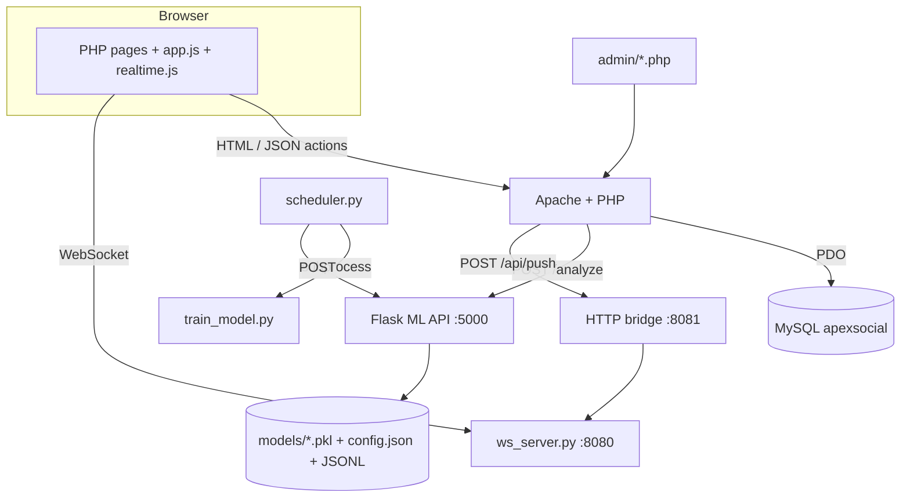
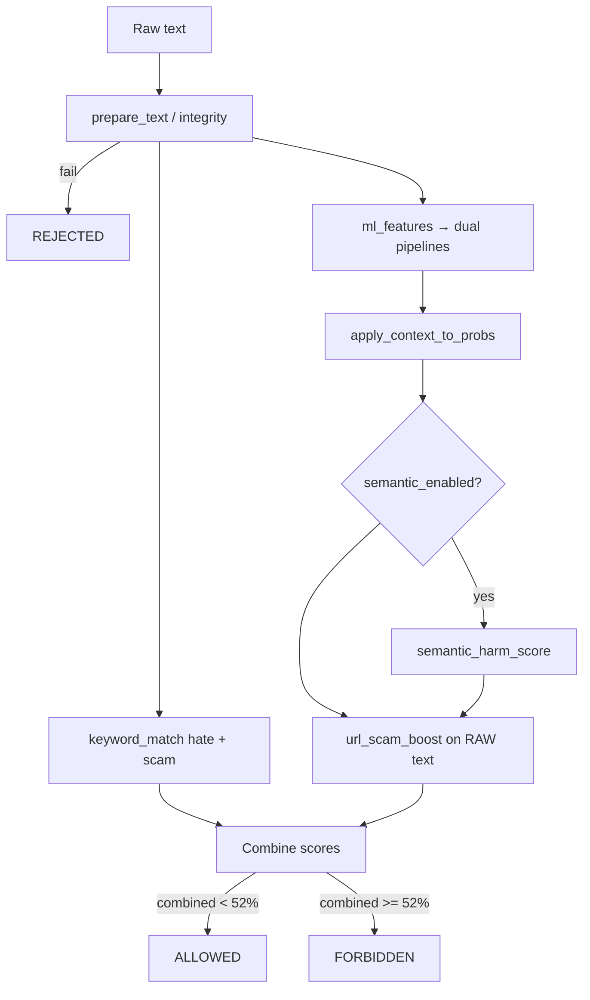
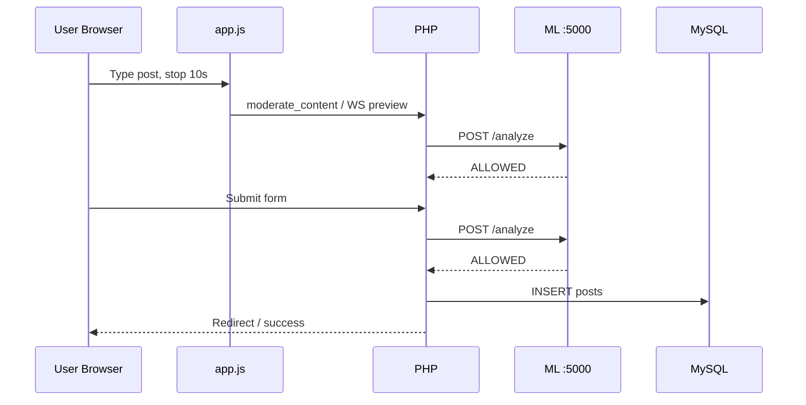

# ApexSocial — Full Technical System Audit

| Field | Value |
|-------|--------|
| **Document** | `docs/FULL_SYSTEM_AUDIT.md` |
| **Audit date** | 2026-05-28 |
| **Revision** | 2 (full refresh) |
| **Repository** | `c:\xampp\htdocs\apexsocial` |
| **Remote** | `https://github.com/arjanitpronaj/apexsocial.git` |
| **Last commit (local)** | `edf597a` — Initialize ApexSocial local repository and sync latest platform updates |
| **Scope** | PHP web app, Python ML + realtime, MySQL, admin panel, legacy C# backend, assets, docs |
| **Method** | Static review of source, configs, SQL schema, dependency manifests, cross-doc consistency |

> **Canonical audit file.** Use this document for thesis documentation, onboarding, and security review.  
> Dated snapshot: `docs/FULL_SYSTEM_AUDIT_2026-05-28.md` (same revision).

---

## Table of Contents

1. [Executive Summary](#1-executive-summary)
2. [Authoritative Runtime Architecture](#2-authoritative-runtime-architecture-critical)
3. [Technology Stack](#3-technology-stack-analysis)
4. [Frontend Audit](#4-frontend-audit)
5. [Backend (PHP) Audit](#5-backend-php-audit)
6. [Database Audit](#6-database-audit)
7. [API & Communication](#7-api--communication-audit)
8. [Machine Learning / AI](#8-machine-learning--ai-audit)
9. [Realtime Subsystem](#9-realtime-subsystem)
10. [Authentication & Security](#10-authentication--security-audit)
11. [DevOps & Infrastructure](#11-devops--infrastructure-audit)
12. [Performance](#12-performance-audit)
13. [Code Quality](#13-code-quality-audit)
14. [Dependencies](#14-dependency-audit)
15. [System Flows](#15-system-flow-documentation)
16. [File Structure](#16-file-structure-audit)
17. [Documentation Index & Drift](#17-documentation-index--drift-matrix)
18. [Security Risk Matrix](#18-security-risk-matrix)
19. [Improvement Recommendations](#19-improvement-recommendations)
20. [Final Technical Evaluation](#20-final-technical-evaluation)
21. [Appendices](#21-appendices)

---

## 1. Executive Summary

### 1.1 System Overview

**ApexSocial** is a content-moderated social platform for posts, comments, likes, friendships, notifications, user reports, and an admin moderation queue. Harmful content (hate speech, scams/phishing) is detected by a **hybrid Python ML service** integrated with PHP.

### 1.2 Main Purpose

- Social interaction (feed, profile, explore, saved, friends).
- **AI-assisted moderation** before and during publish (binary **ALLOWED** / **FORBIDDEN**).
- Admin review, feedback loop to ML, scheduled/incremental retraining.
- Realtime notifications and live moderation preview via **Python WebSocket** (not C# SignalR in the active path).

### 1.3 Overall Architecture (Authoritative)



### 1.4 Top Findings

| # | Finding | Severity |
|---|---------|----------|
| 1 | **README and some docs still describe C# Singular Core as central**; runtime uses **PHP → ML direct** and **Python WS** on 8080/8081 | High (operational drift) |
| 2 | **Plaintext passwords** in schema and auth (by explicit project requirement in `database.sql`) | Critical (production) |
| 3 | **No CSRF** on state-changing `ajax.php` actions | Critical |
| 4 | **XSS risk** via `innerHTML` templates in `app.js` for dynamic content | High |
| 5 | **CSP includes `unsafe-eval`** (compatibility workaround) | Medium–High |
| 6 | ML pipeline is **mature and well-structured**; governance of pickle artifacts and feedback data is weak | Medium |
| 7 | **No CI/CD**, no pinned Python lockfile, WS deps (`websockets`, `aiohttp`) not in `requirements.txt` | Medium |
| 8 | Monolithic `style.css` (~1684 lines) and `app.js` (~755 lines) increase regression risk | Medium |

### 1.5 Technical Maturity

| Label | Assessment |
|-------|------------|
| **Stage** | Advanced prototype / pre-production |
| **Feature completeness** | High |
| **Production safety** | Low–medium until auth, CSRF, XSS, secrets are hardened |
| **ML subsystem** | Strong relative to rest of stack |

---

## 2. Authoritative Runtime Architecture (Critical)

This section is the **single source of truth** for how the system runs today. Several older files contradict it.

### 2.1 Active Services

| Service | Entry point | Port | Role |
|---------|-------------|------|------|
| Apache + PHP | XAMPP `htdocs/apexsocial` | 80 | Web UI, `ajax.php`, admin |
| MySQL | XAMPP | 3306 | Persistence |
| ML API | `ml_api/api.py` (Waitress) | **5000** | `/analyze`, training admin endpoints |
| WebSocket | `ml_api/ws_server.py` | **8080** | Client WS, `preview_moderation` |
| HTTP push bridge | `ml_api/ws_server.py` (aiohttp) | **8081** | `POST /api/push` from PHP |
| Scheduler | `ml_api/scheduler.py` | — | Nightly incremental + weekly full retrain |
| C# backend (legacy) | `Backend/Program.cs` | 8080 (conflict) | **Not authoritative**; conflicts with Python WS port |

### 2.2 Moderation Authority Chain

1. **Browser:** 10s inactivity countdown → optional WS preview (`realtime.js`) → submit.
2. **PHP:** `moderateContent()` → `mlAnalyze()` → `POST http://127.0.0.1:5000/analyze`.
3. **Python:** `analyze()` hybrid pipeline → verdict.
4. **PHP:** If `FORBIDDEN` or ML offline (fail-closed) → block persist; else INSERT post/comment.
5. **Admin:** `admin/queue.php` → approve/reject → `POST /feedback` for online learning.

**Verdicts:** `ALLOWED`, `FORBIDDEN`, `REJECTED` (integrity failure), `OFFLINE` (PHP when ML unreachable).

There is **no** end-user `REVIEW` publish state in the ML API (`borderline_review_only: false` in config).

### 2.3 What README Claims vs Reality

| README (`README.md`) | Actual code |
|----------------------|-------------|
| PHP never calls Python directly | **`includes/config.php` calls ML via cURL** |
| C# Singular Core on :8080 | **`ws_server.py` binds :8080** |
| SignalR realtime | **`websockets` + push bridge** |
| Plain text passwords “as required” | **Still true in DB** |

**Action:** Update `README.md` and `docs/REALTIME_ARCHITECTURE.md` to match Section 2 or mark C# as deprecated optional module.

### 2.4 Startup Checklist (Windows / XAMPP)

```text
1. Start Apache + MySQL (XAMPP)
2. Import database.sql if needed
3. cd ml_api && pip install -r requirements.txt
4. pip install websockets aiohttp   # required for ws_server; not in requirements.txt
5. python train_model.py            # first-time / after dataset changes
6. python api.py                    # :5000
7. python ws_server.py              # :8080 + :8081
8. python scheduler.py              # optional automated retrain
```

Do **not** run C# Backend on 8080 concurrently with `ws_server.py`.

---

## 3. Technology Stack Analysis

| Layer | Technology | Version / notes | Purpose | Primary risks |
|-------|------------|-----------------|---------|---------------|
| Web | XAMPP Apache + PHP 8-style | Local dev | Pages, sessions, uploads | Weak prod hardening |
| DB | MySQL 8 | utf8mb4 | Social + moderation data | Plaintext passwords, index gaps |
| ML API | Flask + Waitress | `flask>=2.3` | Inference + ops endpoints | Open bind, pickle load |
| ML | scikit-learn, pandas, numpy | min versions in requirements | TF-IDF + logistic | Unpinned versions |
| Schedule | APScheduler | `>=3.10` | Retrain cron | Process not supervised |
| Realtime | websockets, aiohttp | **implicit** | WS + push | Missing from requirements.txt |
| Legacy | ASP.NET Core 8 + SignalR | `Backend/` | Alternate stack | Port/doc conflict |
| Frontend | Vanilla JS, CSS | No bundler | UI + moderation UX | XSS, monolithic assets |
| Fonts | Google Fonts (Inter) | CDN | Typography | CSP external dependency |

No Composer, npm, Docker, or GitHub Actions detected in repository (~136 tracked files).

---

## 4. Frontend Audit

### 4.1 Structure

| Asset | Lines (approx.) | Responsibility |
|-------|-----------------|----------------|
| `assets/js/app.js` | 755 | Feed, composer, comments, moderation UX, reports, search |
| `assets/js/realtime.js` | — | WebSocket connect, preview, event handlers |
| `assets/css/style.css` | 1684 | Global UI, mobile responsive block, design tokens |
| `assets/css/admin.css` | — | Admin panel styles |

Pages: `index.php`, `pages/*` (login, register, profile, friends, notifications, settings, saved, explore, banned), `admin/*`.

### 4.2 Moderation UX (Current)

- **10-second inactivity countdown** before ML check (`COUNTDOWN_SEC = 10` in `app.js`).
- Status states: idle → countdown → analyzing → allowed/forbidden/offline.
- WebSocket path for faster preview when `realtime.js` connected.
- Post button disabled until moderation completes successfully.

### 4.3 Recent UI Features (Rev 2)

- **Inter** font via Google Fonts (multiple PHP pages).
- **Mobile navigation** and responsive CSS breakpoints (640–1000px).
- **Report content** on posts and comments (`openReport()`).
- CSS refresh: variables, post cards, navbar, composer.

### 4.4 Security (Frontend)

| Issue | Detail |
|-------|--------|
| XSS | Dynamic HTML via `innerHTML` for comments, search, avatars |
| CSP | `script-src` includes `'unsafe-inline'` and `'unsafe-eval'` in `config.php` |
| WS token | HMAC token from PHP; verified in `ws_server.py` |

### 4.5 Recommendations

- Split `app.js` into modules (moderation, social, reports).
- Replace `innerHTML` with safe DOM APIs or strict escaping layer.
- Self-host fonts; tighten CSP after removing `unsafe-eval` root cause.

---

## 5. Backend (PHP) Audit

### 5.1 Core Files

| File | Role |
|------|------|
| `includes/config.php` | DB, session, CSP, `moderateContent()`, `mlAnalyze()`, helpers |
| `includes/ajax.php` | JSON action router (~269 lines) |
| `includes/sanitize.php` | XSS payload detection, text validation, `apex_e()` |
| `includes/realtime.php` | Push bridge to :8081 |
| `includes/navbar.php` | Shared navigation |

### 5.2 AJAX Actions (`includes/ajax.php`)

| Action | Auth | Purpose |
|--------|------|---------|
| `moderate_content` | User | Pre-submit ML check |
| `toggle_like` | User | Like/unlike |
| `add_comment` | User | Comment + ML |
| `load_comments` | User | Fetch thread |
| `delete_comment` | User | Soft delete |
| `delete_post` | User | Delete own post |
| `friend_request` | User | Send request |
| `respond_friend` | User | Accept/reject |
| `search` | User | User search |
| `repost` | User | Repost with ML |
| `report_content` | User | User report |

**Gap:** No CSRF token validation on any action.

### 5.3 ML Integration (`config.php`)

```php
// PHP calls ML directly (authoritative)
ML_API_URL = 'http://127.0.0.1:5000'
moderateContent() → mlAnalyze() → POST /analyze
```

- **Fail-closed:** If ML offline → `FORBIDDEN` with user-facing message (posting blocked).
- **Logging:** `logAnalysis()` → `content_analysis` table (errors swallowed in empty catch).

### 5.4 Admin Panel

| Page | Function |
|------|----------|
| `admin/index.php` | Dashboard |
| `admin/queue.php` | Pending moderation + ML feedback |
| `admin/posts.php`, `all_posts.php` | Post management |
| `admin/users.php` | Users, ban |
| `admin/reports.php` | User reports |
| `admin/harmful.php` | Harmful content log |
| `admin/ml_stats.php` | ML statistics |
| `admin/dataset.php`, `scan.php`, `activity.php` | Ops tools |

### 5.5 Uploads

- Path: `uploads/` (avatars, post images/PDF).
- Allowed extensions: `jpg,jpeg,png,gif,webp,pdf` (max 20 MB).
- **Gap:** Extension-based validation; limited MIME/magic-byte checks.

---

## 6. Database Audit

### 6.1 Tables

| Table | Purpose |
|-------|---------|
| `users` | Accounts, ban state, admin flag |
| `posts` | Content, ML fields, status enum |
| `comments` | Thread comments + ML metadata |
| `likes` | Unique (post_id, user_id) |
| `friendships` | Directed requests |
| `notifications` | Activity feed |
| `content_analysis` | ML audit log |
| `reports` | User-submitted reports |

### 6.2 Post/Comment Status Model

`status ENUM('pending','approved','rejected')` — workflow is **DB moderation state**, separate from ML verdict at compose time.

### 6.3 Indexes (Present)

- `posts`: `idx_status`, `idx_user_id`
- `comments`: `idx_post_status`
- `likes`: `uq_like`
- `friendships`: `uq_friendship`
- `notifications`: `idx_user_unread`

### 6.4 Recommended Indexes

```sql
-- Suggested composites for scale
posts(status, created_at DESC)
posts(user_id, status, created_at DESC)
comments(status, created_at DESC)
content_analysis(label, created_at DESC)
reports(status, created_at DESC)
```

### 6.5 Integrity Risks

- Plaintext `users.password` (documented in SQL comments).
- Polymorphic `reports.content_type` / `content_analysis.content_type` without FK to posts/comments.
- Friendship OR-queries (`sender/receiver`) are hard to index optimally.

---

## 7. API & Communication Audit

### 7.1 ML REST API (`ml_api/api.py`)

| Method | Route | Purpose |
|--------|-------|---------|
| POST | `/analyze` | Single text moderation |
| POST | `/analyze_batch` | Batch moderation |
| POST | `/feedback` | Admin label for online learning |
| POST | `/integrity/check` | Text integrity only |
| GET | `/health` | Service + model status |
| GET | `/stats` | Usage / model stats |
| POST | `/retrain` | Manual retrain trigger |
| POST | `/reload_models` | Hot-reload `.pkl` |
| POST | `/test` | Internal test |

Security wrapper: `validate_request()` from `security.py` (rate limit, body size, flood).

### 7.2 WebSocket Protocol (`ws_server.py`)

| Direction | Type | Purpose |
|-----------|------|---------|
| In | `join` | Authenticate with token |
| In | `ping` | Heartbeat |
| In | `preview_moderation` | Live ML preview |
| Out | `notification`, `moderation_result`, `queue_update`, `new_pending`, `banned` | Push events |

PHP push: `POST http://{host}:8081/api/push` with header `X-Api-Key: apex-ws-key-2025` (default; should be env-only).

### 7.3 CORS

Origins from `config.json` / `APEX_CORS_ORIGINS` env — localhost-focused.

---

## 8. Machine Learning / AI Audit

### 8.1 Model Artifacts

| File | Model |
|------|-------|
| `ml_api/models/pipeline.pkl` | Hate speech |
| `ml_api/models/scam_pipeline.pkl` | Scam / phishing |
| `ml_api/models/config.json` | Thresholds, keywords, security |
| `ml_api/models/user_inputs.jsonl` | Incremental training log |
| `ml_api/models/analysis_log.jsonl` | Inference log (trimmed at 5000) |
| `ml_api/models/online_state.json` | Retrain state |

### 8.2 Training (`train_model.py` v6)

- **Vectorizer:** `TfidfVectorizer(analyzer="char_wb", ngram_range=(3, 5), lowercase=False, max_features=30000, sublinear_tf=True)`
- **Classifier:** `LogisticRegression(class_weight="balanced")` inside `CalibratedClassifierCV(method="sigmoid")`
- **Function:** `train_and_save()` (not legacy `train_sklearn` name)
- **Datasets:** `ml_api/models/datasets/*` + `user_inputs.jsonl`
- **Balance:** `balance_dataset()` max 3:1 ratio
- **Keyword repair:** mislabeled safe rows fixed via `keyword_match()` during training

### 8.3 Inference Pipeline (`analyze()`)



**Threshold:** `threshold_low` / `threshold` = **0.52** (52%). High band = 0.78.

**URL handling:** `ml_features()` replaces URLs with token `url` for TF-IDF; **`url_scam_boost()` and `find_urls()` run on original raw text**.

**Keywords:** `keyword_match()` with word boundaries, negation lookback, safe hate context — **not** legacy `kw_hit_boundary()`.

### 8.4 Online Learning & Scheduler

| Component | Behavior |
|-----------|----------|
| `online_learning.py` | Log samples; auto-retrain when N samples |
| `scheduler.py` | Incremental ~03:00 UTC; full weekly; calls `/reload_models` |
| Admin feedback | `POST /feedback` from queue |

**Risks:** Adversarial feedback poisoning; pickle trust; PII in JSONL logs.

### 8.5 ML Security Controls (Present)

- Rate limiting per IP (`security.py`)
- Max body / text length
- Integrity rejection path
- Thread lock on model reload

---

## 9. Realtime Subsystem

**Authoritative implementation:** `ml_api/ws_server.py` (docstring: *replaces C# SignalR*).

| Concern | Implementation |
|---------|----------------|
| Client URL | Injected via PHP (`window.APEX_WS_URL`) |
| Auth | HMAC `WS_SECRET` + session token |
| Admin channel | Separate `admin_connections` set |
| PHP integration | `apexRealtimePush()` fire-and-forget cURL |

**Legacy:** `Backend/Program.cs` SignalR hub — only use if Python WS is stopped and port conflict resolved.

---

## 10. Authentication & Security Audit

### 10.1 OWASP-Oriented Summary

| Category | Risk | Notes |
|----------|------|-------|
| A01 Broken Access Control | Medium–High | Role checks exist; no CSRF |
| A02 Cryptographic Failures | **Critical** | Plaintext passwords |
| A03 Injection | Medium | Prepared SQL; XSS in JS rendering |
| A04 Insecure Design | High | Dual backend documentation |
| A05 Misconfiguration | High | Default API keys, CSP relaxed |
| A07 Auth Failures | **Critical** | Password storage model |
| A08 Integrity | High | pickle.load on `.pkl` |
| A09 Logging | Medium | No centralized SIEM |

### 10.2 Session Model

- PHP `session_start()` in `config.php`.
- Roles: `user`, `admin` in `$_SESSION['role']`.
- Ban check: `checkSessionValid()` redirects to `banned.php`.

### 10.3 Secrets (Defaults in Source — Rotate)

| Secret | Default location |
|--------|------------------|
| `APEX_WS_KEY` | `realtime.php`, `ws_server.py` → `apex-ws-key-2025` |
| `WS_SECRET` | `ws_server.py` → `apex-ws-secret` |
| DB creds | `config.php` root/empty |

---

## 11. DevOps & Infrastructure Audit

| Area | Status |
|------|--------|
| Deployment | Manual XAMPP + manual Python processes |
| CI/CD | None |
| Containers | None |
| TLS / reverse proxy | Not configured in repo |
| Monitoring | File logs `ml_api/models/logs/apex_ml.log` |
| Migrations | Single `database.sql` bootstrap only |
| Git | Initialized; pushed to GitHub `main`/`master` |

**Production readiness (infra): 4.5 / 10**

---

## 12. Performance Audit

| Area | Bottleneck | Mitigation |
|------|------------|------------|
| Feed query | Joins + subqueries | Indexes, pagination, cache |
| Admin dashboard | Multiple COUNT queries | Materialized stats / single query |
| Frontend | 1684-line CSS, 755-line JS | Split, minify, cache headers |
| ML inference | CPU sklearn | Acceptable at small scale; batch endpoint for bulk |
| Retrain | subprocess in scheduler | Off-peak only; lock during reload |

---

## 13. Code Quality Audit

### 13.1 Strengths

- Clear separation `ml_api/` vs PHP vs `admin/`.
- ML modules: `text_integrity`, `text_utils`, `context_scoring`, `security`, `semantic_scorer`.
- Consistent `prepare_text` / `ml_features` between train and inference.

### 13.2 Debt Hotspots

| File | Issue |
|------|-------|
| `README.md` | Wrong architecture |
| `assets/css/style.css` | Size + duplicate rules |
| `assets/js/app.js` | Multiple concerns in one file |
| `includes/ajax.php` | No service layer |
| `Backend/` | Legacy overlap |

### 13.3 Dead / Legacy

- C# backend as parallel stack.
- `docs/REALTIME_ARCHITECTURE.md` references SignalR events not emitted by Python WS with same names everywhere.

---

## 14. Dependency Audit

### 14.1 Python (`ml_api/requirements.txt`)

```
flask>=2.3.0, flask-cors>=4.0.0
scikit-learn>=1.3.0, pandas>=2.0.0, numpy>=1.24.0
openpyxl>=3.1.0, waitress>=3.0.0, apscheduler>=3.10.0
```

**Missing (used at runtime):** `websockets`, `aiohttp`

**Optional (commented):** `transformers`, `torch` for semantic transformer path

### 14.2 C# (`Backend/ApexSocial.csproj`)

- .NET 8.0, MySqlConnector 2.3.7

### 14.3 PHP / JS

- No Composer / package.json
- External: Google Fonts CDN

**Recommendation:** `pip freeze` or Poetry lock; add WS deps; Dependabot/GitHub Actions audit.

---

## 15. System Flow Documentation

### 15.1 New Post (Happy Path)



### 15.2 Blocked Content

ML returns `FORBIDDEN` → PHP does not insert (or marks rejected) → user sees reason in UI.

### 15.3 Admin Correction

Admin rejects/approves in queue → PHP → `POST /feedback` → sample in `user_inputs.jsonl` → eventual retrain.

---

## 16. File Structure Audit

```text
apexsocial/
├── index.php                 # Main feed
├── database.sql              # Schema + seed
├── README.md                 # ⚠ needs architecture update
├── includes/
│   ├── config.php            # Core bootstrap + ML bridge
│   ├── ajax.php              # API actions
│   ├── realtime.php          # Push bridge
│   └── sanitize.php
├── pages/                    # User-facing routes
├── admin/                    # Moderation panel
├── assets/js/, assets/css/
├── uploads/                  # User media (runtime)
├── ml_api/
│   ├── api.py                # Flask app
│   ├── train_model.py
│   ├── ws_server.py
│   ├── scheduler.py
│   ├── online_learning.py
│   ├── text_utils.py, text_integrity.py, security.py
│   └── models/               # pkl, config, datasets, logs
├── Backend/                  # Legacy C# SignalR
├── docs/
│   ├── FULL_SYSTEM_AUDIT.md          # this file
│   ├── FULL_SYSTEM_AUDIT_2026-05-28.md
│   ├── UDHEZUES_TEKNIK_I_PLOTE.md
│   ├── MODERIMI_APEXSOCIAL.md
│   └── REALTIME_ARCHITECTURE.md
└── scripts/                  # Thesis tooling (non-runtime)
```

---

## 17. Documentation Index & Drift Matrix

| Document | Language | Status | Notes |
|----------|----------|--------|-------|
| `FULL_SYSTEM_AUDIT.md` | EN | **Current** | This audit (Rev 2) |
| `UDHEZUES_TEKNIK_I_PLOTE.md` | SQ | Partial | Align with Section 2 |
| `MODERIMI_APEXSOCIAL.md` | SQ | Partial | Good for thesis Ch.9 |
| `REALTIME_ARCHITECTURE.md` | EN | **Stale** | Says SignalR/C#; update to Python WS |
| `README.md` | EN | **Stale** | Claims C# central, PHP→Python forbidden |

**Thesis alignment:** Use hybrid ML description (`char_wb` 3–5, dual models, 52% threshold, URL on raw text). Remove references to `kw_hit_boundary`, `train_sklearn`, C#-only flow, REVIEW verdict.

---

## 18. Security Risk Matrix

| Risk | Severity | Area | Mitigation |
|------|----------|------|------------|
| Plaintext passwords | Critical | DB, login | `password_hash()` migration |
| Missing CSRF | Critical | ajax.php | Session CSRF tokens |
| DOM XSS | High | app.js | Safe DOM APIs |
| Default WS/API keys | High | realtime, ws_server | Env-only secrets |
| Pickle RCE | High | api.py | Signed artifacts + checksum |
| Weak upload validation | High | uploads | MIME + magic bytes |
| CSP unsafe-eval | Medium | config.php | Remove after root-cause fix |
| Architecture doc drift | Medium | README | Single authoritative doc |
| DB index gaps | Medium | feed/admin | Composite indexes |
| Unpinned Python deps | Low–Medium | requirements | Lock file + CI scan |

---

## 19. Improvement Recommendations

### 19.1 Critical (0–30 days)

1. Migrate passwords to bcrypt/argon2 (even if thesis mentioned plaintext for demo, document as dev-only).
2. Implement CSRF on all `ajax.php` POST actions.
3. Rotate `APEX_WS_KEY`, `WS_SECRET`; remove hardcoded defaults.
4. Update `README.md` + `REALTIME_ARCHITECTURE.md` to Python WS architecture.

### 19.2 Security (30–60 days)

1. Harden uploads; virus scan optional.
2. Fix XSS paths; restore strict CSP.
3. Add security headers (HSTS, X-Content-Type-Options, Referrer-Policy).

### 19.3 Architecture (60–90 days)

1. Deprecate or isolate `Backend/` C# project.
2. Extract PHP service layer from `ajax.php`.
3. Add GitHub Actions: lint, `pip audit`, basic smoke tests.

### 19.4 ML Governance

1. Separate admin-verified training set from open feedback.
2. Model version metadata file next to each `.pkl`.
3. Evaluation gate before `reload_models` promotes new weights.

---

## 20. Final Technical Evaluation

| Dimension | Score /10 | Rationale |
|-----------|-----------|-----------|
| Overall code quality | 6.4 | Solid ML; PHP/JS monoliths and doc drift |
| Security | 3.9 | Critical auth/CSRF issues |
| Scalability | 5.2 | OK for demo/small deploy |
| Maintainability | 5.6 | Improving UI; docs still conflict |
| Performance | 5.8 | Adequate; DB/CSS/JS optimization possible |
| ML capability | 7.5 | Hybrid pipeline, dual models, online learning |
| Production readiness | 4.7 | Manual ops, no CI, security gaps |

### Verdict

ApexSocial is a **feature-rich, ML-capable social platform** suitable for **academic demonstration and iterative development**. It is **not production-ready** without addressing authentication, CSRF, XSS, secrets, and documentation accuracy. The **Python ML + PHP + WebSocket** path is the correct basis for all future work.

---

## 21. Appendices

### Appendix A — Environment Variables

| Variable | Used by | Purpose |
|----------|---------|---------|
| `APEX_WS_KEY` | PHP push, ws_server | Push API authentication |
| `WS_SECRET` | ws_server | WS token HMAC |
| `APEX_CORS_ORIGINS` | api.py | ML CORS override |
| `APEX_SESSION_TOKENS` | ws_server | Admin flags JSON |

### Appendix B — Default Demo Accounts (`database.sql`)

| Role | Username | Password |
|------|----------|----------|
| Admin | admin | Admin@2024 |
| User | alex_smith | Alex@2024 |

Change before any public deployment.

### Appendix C — ML Config Snapshot (`config.json`)

| Key | Value |
|-----|-------|
| threshold / threshold_low | 0.52 |
| threshold_high | 0.78 |
| semantic_enabled | true |
| retrain_min_samples | 10 |
| retrain_every_n | 8 |
| rate_limit_analyze | 60/min |

### Appendix D — Related Thesis / Project Artifacts

| Artifact | Location |
|----------|----------|
| Thesis Word doc | `TemaDiplomes.docx` (repo root) |
| Thesis patch script | `scripts/patch_thesis_inplace.py` |
| Ch.9 reference extract | `scripts/thesis_ch9_full.txt` |

### Appendix E — 30/60/90 Day Plan

| Window | Actions |
|--------|---------|
| 0–30d | Password hashing, CSRF, secret rotation, README fix |
| 31–60d | DB indexes, upload hardening, JS modularization |
| 61–90d | CI/CD, observability, deprecate C# backend |

---

*End of audit — Revision 2, 2026-05-28.*
